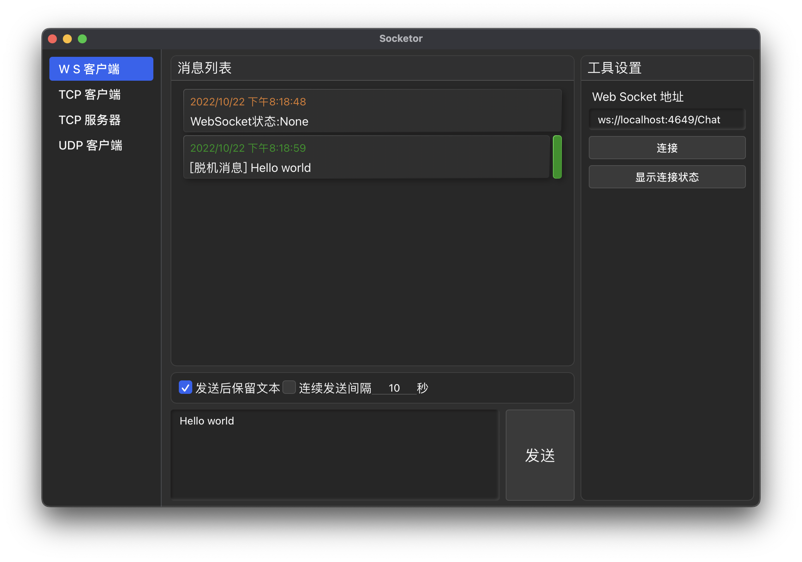

<div align="center">
  
  <h1>Socketor</h1>
  <p>基于 <code>BootstrapBlazor</code> 的轻量级网络调试工具</p>
</div>

# Socketor
一个简单的网络调试工具，当前支持 WebSocket 客户端与服务器，更多功能开发中。 \
 Simple tool for WebSocket, TCP/UDP testing.

 >这曾经是一个非常奇葩的项目，但现在好好休整了一下，接下来会持续优化。



## Requirement
* Tauri 2.0 + Rust edition 2021
* .Net 9 + with Blazor WebAssembly Tool
* WebView2 *(Windows)*
* webkit2gtk *(Linux)*

## Development
Run `dotnet watch run --project src/Socketor.csproj`
Run `cargo tauri dev` under the main directory to start the project.

## How To Build
Run `cargo tauri build` under the main directory to pack the executable file.

## Utilities
|                  |             |
|------------------|-------------|
| WebSocket Client | Finished    |
| WebSocket Server | Finished    |
| TCP Client       | In Progress |
| TCP Server       | Finished    |
| UDP Client       | Plan        |
| gRPC Client      | Plan        |
| SignalR Client   | Plan        |


## 构建与开发
```bash
# 启动Blazor开发服务器
dotnet watch run --project src/Socketor.csproj

# 启动Tauri开发环境
cargo tauri dev

# 构建生产包
cargo tauri build
```

## BootstrapBlazor UI 组件库
[BootstrapBlazor](https://blazor.zone) 是一套基于 Bootstrap 和 Blazor 的企业级组件库，无缝整合了 Bootstrap 框架与 Blazor 技术。它提供了一整套强大的工具，使开发者能够轻松创建响应式和交互式的 Web 应用程序
